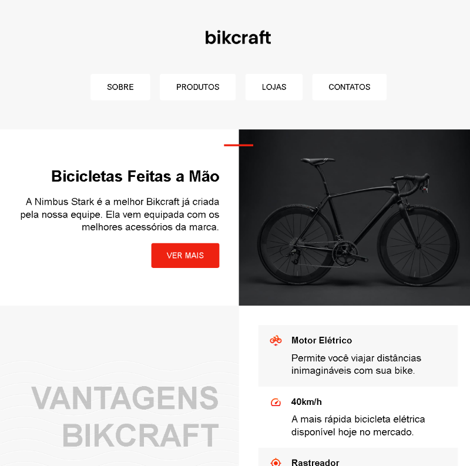

# 🚲 Bikcraft

Projeto de site institucional desenvolvido para praticar **HTML e CSS**, com foco em **estruturação semântica, responsividade e organização de código**.

O Bikcraft simula o site de uma marca de bicicletas personalizadas, apresentando produtos, diferenciais e informações de contato de forma clara e moderna.

---

## 🔗 Demonstração

👉 Acesse o projeto online:  
https://ewtfiwl.github.io/Bikcraft/

---

## 🛠️ Tecnologias utilizadas

- HTML5
- CSS3 (Flexbox e Grid)
- Git & GitHub
- GitHub Pages

---

## 📱 Funcionalidades

- Layout responsivo para desktop e mobile
- Estrutura HTML semântica
- Navegação clara e organizada
- Estilização moderna e consistente
- Projeto publicado com GitHub Pages

---

## 🎯 Objetivo do projeto

Este projeto foi desenvolvido com o objetivo de:

- Consolidar fundamentos de **front-end**
- Praticar organização de pastas e arquivos
- Criar um projeto realista para portfólio
- Treinar versionamento com Git e GitHub

---

## 📸 Preview

---

## 👤 Autor

Desenvolvido por **Enzo Lemos**  
🔗 https://github.com/ewtfiwl
